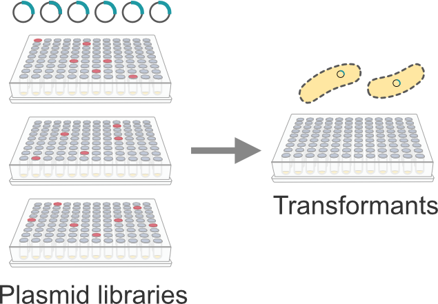

# Transformation cherry-picking

This OT-2 protocol uses a single channel pipette to transfer plasmids from up to 3 different plasmid plates to the transformation plate. An Excel template is provided to specify the source and destination wells. This protocol requires the OT-2 Temperature Module GEN2, a p300 multichannel, and a p20 single channel pipette.

## Set-up:

1. Modify the input file with source plate(s) and source well locations.
2. Modify the custom labware path in *Generate_transformation_cherrypicking_protocol.py* and run to output the OT-2 protocol. 
3. Load the NEST 12-well reservoir with X mL of competent cells into well A1. 
4. Load 50 mL of LB into the NEST 195 mL 1-well reservoir in deck position 7. 
5. Load 50 mL of LB with 3X antibiotic into the NEST 195 mL 1-well reservoir in deck position 6. 
6. Run the protocol. 
7. After the protocol pauses after LB addition, seal the plate and shake-incubate for 1 h for outgrowth. 
8. Return the plate to the robot, unseal, and resume the protocol to add LB + 3X antibiotic. 
9. After the protocol is complete, seal the plate and shake-incubate until saturated (up to 40 h). 

## Notes:
Recommended to pre-chill the 12-well reservoir for the competent cells and the 96-well transformation plate. 

To use simulate, modify the custom labware path in the script. 
