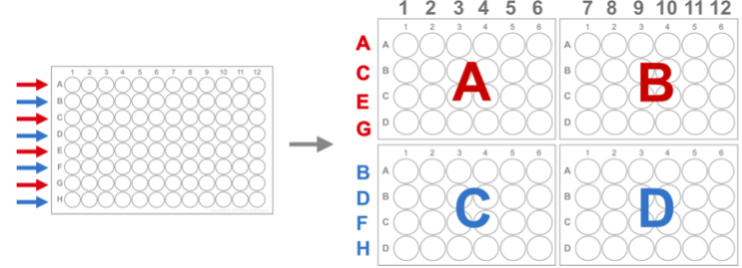

# Inoculation row swap

This OT-2 protocol uses a half-loaded multichannel pipette to transfer the inoculum from the overnight starter plate to the expression plates. This protocol requires the OT-2 p300 multichannel pipette. 

## Set-up:
1. Prepare saturated starter cultures in a 96-deep-well plate.
2. Fill four 24-deep-well plates with 2 mL of autoinduction media. 
3. Load the pipette tips such that only rows A, C, E, G contain tips. 

4. Calibrate the labware offsets:

    - The tips and 96-well starter cultures plates are calibrated normally. 

    - The 24-deep well plates are calibrated such that the half loaded tips are centered in the wells. High calibration accuracy is not critical. 

## Notes:

To use simulate, modify the custom labware path in the script. 