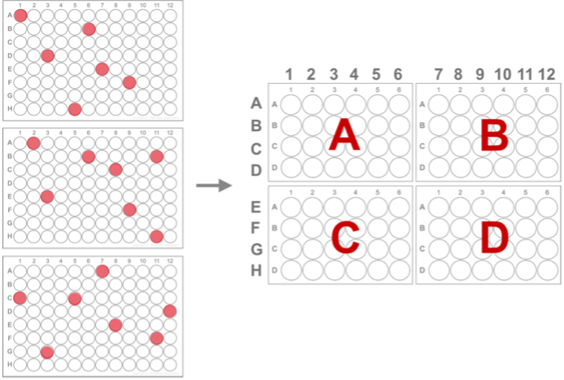

# Inoculation cherry-picking

This OT-2 protocol uses a single channel pipette to transfer the inoculum from up to 3 different overnight starter plates to up to four 24-well expression plates. An Excel template is provided to specify the source and destination wells. This protocol requires the OT-2 p300 single channel pipette.

## Set-up:

1. Prepared saturated starter cultures in 96 well plates. 
2. Modify the input file with source plates and source well locations. 
3. Modify the custom labware path and run *Generate_inoculation_cherrypicking_protocol.py*. This outputs the OT-2 protocol and a file that records the new platemap that will be generated by this cherry-picking inoculation. 
4. Load the four 24 well plates with 2 mL of autoinduction media. 

## Notes:

The four 24 well plates are mapped as a 96 well plate for the destination locations (as shown in the image). 
