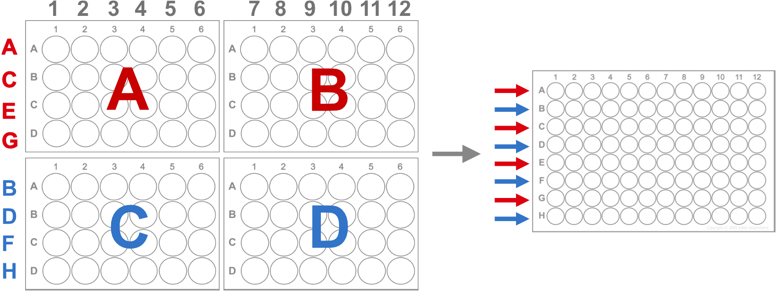

# Transfer row swap

This OT-2 protocol uses a half-loaded multichannel pipette to transfer the magnetic beads from four 24-well plates to one 96-well plate. This protocol requires a p300 multichannel pipette.  

## Set-up:
1. Accurately calibrate labware offsets, especially for the 24 well plates, with the tip centered in the well and the end of tip flush with top of well. We recommend testing the z offset by placing a rigid piece of paper across the top of the plate and align the end of the tip to be *slightly* below the paper. 
2. Load the pipette tips such that only rows A, C, E, G contain tips. 

## Notes:

To use simulate, modify the custom labware path in the script. 